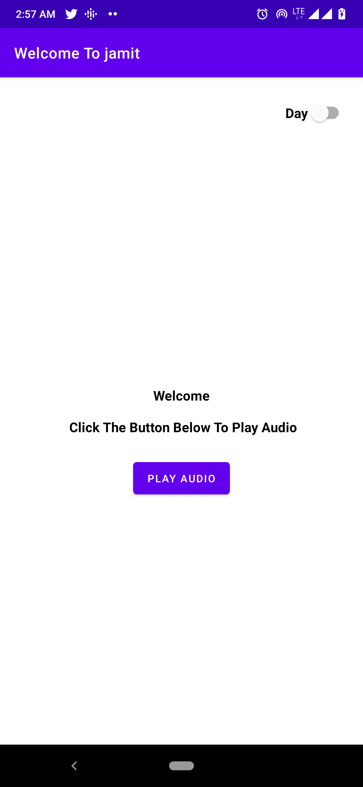
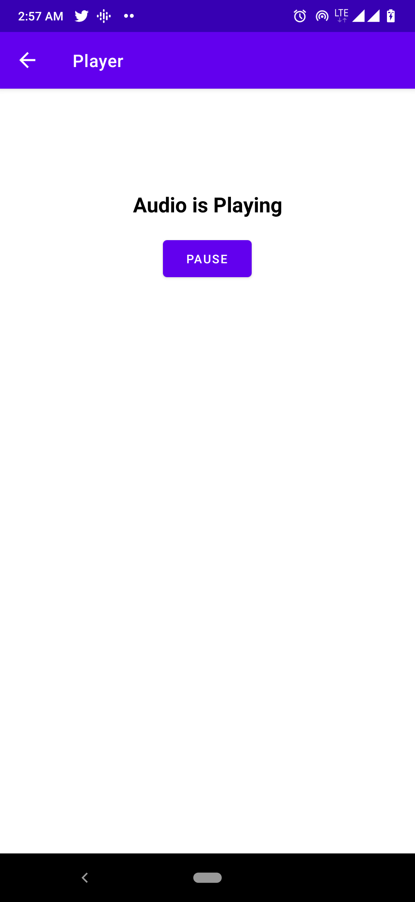
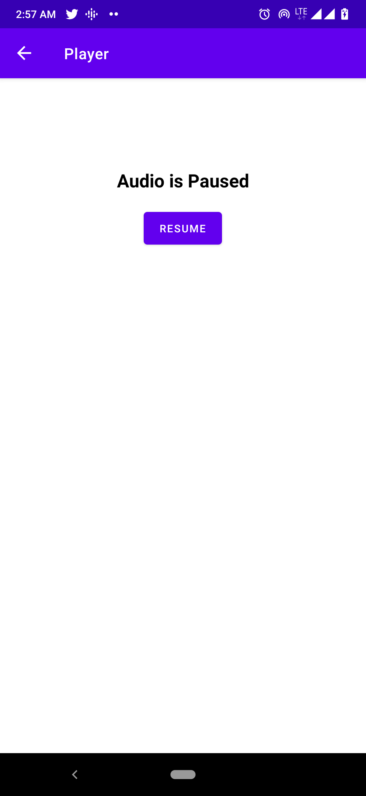
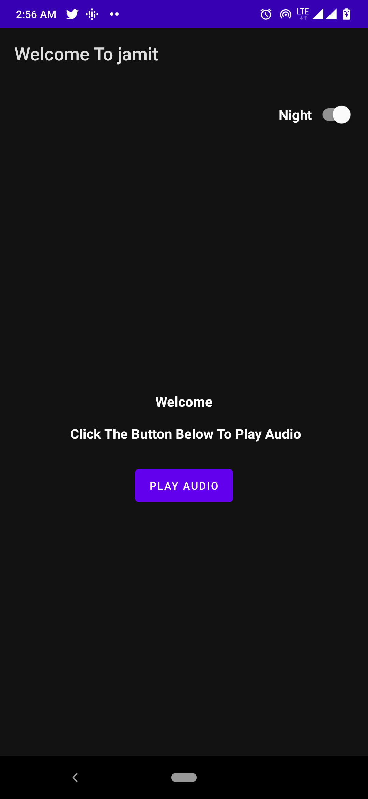
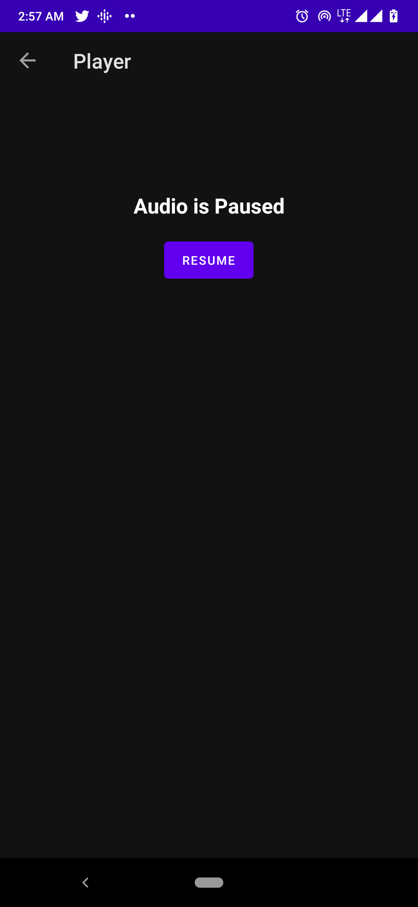

# Jamit-Android-Developer-Challenge

A simple app that plays audio from a given URL using the android MediaPlayer API; This is my submission for the Android Developer Assessment it also
shows some of the best practices in Android Development. Including:

* Data Persistence with SharedPreferences
* Navigation Component

[Download APK](https://github.com/chydee/Jamit-Android-Developer-Challenge/releases/download/v1.0/app-debug.apk)

Minimum Api Level : 21 compileSdkVersion : 30

Build System : [Gradle](https://gradle.org/)

## Instruction

Build a simple android application that utilizes the MediaPlayer API to play an audio from a URL Audio
URL: https://www.soundhelix.com/examples/mp3/SoundHelix-Song-10.mp3

The app should have:

- 2 Screens
   - A welcome screen with two views (TextView and Button)
   - A Player screen with two views (TextView and Button)
- Day and Night mode toggle

## Screenshots

## Installation Guide

    Follow these steps if you want to get a local copy of the project.

    Prerequisites
    Android Studio IDE 3.0+
    Android SDK v28
    Android Build Tools v28.0.3
    Gradle 4.10.1
    1. Clone or fork the repository (Master Branch) by running the command below
    on your git terminal

    git clone https://github.com/chydee/Jamit-Android-Developer-Challenge.git
    2. Import the project in AndroidStudio
    In Android Studio, go to File -> New -> Import project
    Follow the dialog for set up instructions

    To run this application, please use an Android device or emulator (OS 5.0 or newer).
